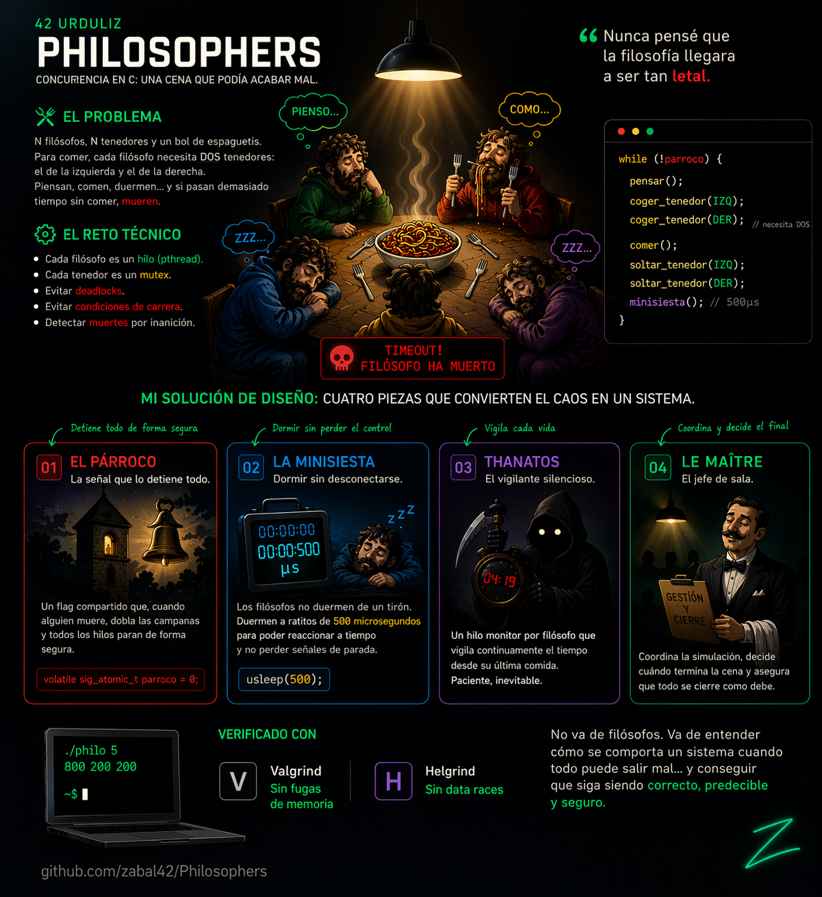

# philosophers

> *"El problema de los filósofos cenando"* — E. W. Dijkstra, 1965

Simulación del clásico problema de concurrencia implementada en C con hilos POSIX (`pthreads`) y exclusión mutua (`mutex`). Un proyecto de la escuela 42 que pone a prueba la gestión de recursos compartidos, la sincronización entre hilos y la detección de condiciones de carrera.

"*Diseño orientado a entornos con restricciones: sin librerías externas, gestión manual de memoria y sincronización, código auditado bajo normas 42.*"


---

## Índice

- [El Problema](#el-problema)
- [Uso](#uso)
- [Arquitectura del Programa](#arquitectura-del-programa)
- [Estructuras de Datos](#estructuras-de-datos)
- [Gestión de Hilos y Mutex](#gestión-de-hilos-y-mutex)
- [El Párroco](#el-párroco)
- [La Minisiesta](#la-minisiesta)
- [Decisiones de Diseño Propias](#decisiones-de-diseño-propias)
- [Flujo de Ejecución](#flujo-de-ejecución)
- [Compilación](#compilación)

---

## El Problema

N filósofos se sientan alrededor de una mesa circular. Entre cada par de filósofos adyacentes hay un tenedor (N tenedores en total). Cada filósofo necesita **dos tenedores** para comer.

```
        [FILO 1]
       /        \
   Fork 5      Fork 1
     /              \
[FILO 5]          [FILO 2]
     \              /
   Fork 4      Fork 2
       \        /
        [FILO 4]--Fork 3--[FILO 3]
```

Los filósofos alternan entre tres estados: **pensar**, **comer** y **dormir**. Si un filósofo no come antes de que transcurra `time_to_die` milisegundos desde su última comida (o desde el inicio), muere. El objetivo del programa es gestionar los hilos para que ningún filósofo muera de hambre, o al menos detectar y reportar su muerte limpiamente.

---

## Uso

```bash
make
./philo <num_filos> <tiempo_para_morir> <tiempo_para_comer> <tiempo_para_dormir> [comidas_requeridas]
```

| Argumento | Tipo | Descripción |
|---|---|---|
| `num_filos` | entero | Número de filósofos (y de tenedores) |
| `tiempo_para_morir` | ms | Si el filósofo no come en este tiempo, muere |
| `tiempo_para_comer` | ms | Tiempo que tarda en comer (con 2 tenedores) |
| `tiempo_para_dormir` | ms | Tiempo que tarda en dormir |
| `comidas_requeridas` | entero (opcional) | Si se indica, la simulación termina cuando todos han comido este número de veces |

### Ejemplos

```bash
# 5 filósofos, no debería morir ninguno
./philo 5 800 200 200

# 4 filósofos con límite de comidas
./philo 4 410 200 200 5

# 1 filósofo (caso especial: muere siempre)
./philo 1 800 200 200

# Uno muere: tiempo_para_morir demasiado ajustado
./philo 4 310 200 200
```

### Formato de salida

```
[timestamp_ms] N has taken a fork
[timestamp_ms] N is eating
[timestamp_ms] N is sleeping
[timestamp_ms] N is thinking
[timestamp_ms] N died 💀
```

---

## Arquitectura del Programa

```
philo/
├── inc/
│   └── philo.h            ← Structs, prototipos y cabeceras
└── src/
    ├── main.c             ← Validación de args, orquestación general
    ├── init.c             ← Inicialización de config y filósofos
    ├── filo_routine.c     ← Lógica del hilo filósofo (comer, dormir, pensar)
    ├── thanatos.c         ← Hilo monitor de muerte (el Párroco)
    ├── maitre.c           ← Hilo contador de comidas (fin por saciedad)
    ├── simulation.c       ← Creación y join de hilos, limpieza
    └── utils.c            ← Tiempo, impresión segura, Minisiesta
```

### Hilos en ejecución

Para N filósofos el programa crea:

| Hilo | Cantidad | Función | Rol |
|---|---|---|---|
| Filósofo | N | `philo_routine()` | Simula el ciclo comer/dormir/pensar |
| Thanatos | N | `thanatos()` | Vigila si su filósofo ha muerto de hambre |
| Maitre | 0 ó 1 | `maitre()` | Termina la sim. cuando todos están saciados |

**Total de hilos activos:** `2N` (+ 1 si se especifica `comidas_requeridas`).

---

## Estructuras de Datos

### `t_config` — Configuración global compartida

```c
typedef struct s_config
{
    int             num_filos;       // Número de filósofos
    int             time_to_die;     // ms hasta la muerte por hambre
    int             time_to_eat;     // ms que dura una comida
    int             time_to_sleep;   // ms que dura el sueño
    int             meals_required;  // Comidas necesarias (-1 = sin límite)
    int             someone_died;    // FLAG DEL PÁRROCO (0 = vivos, 1 = parar)
    long            start_time;      // Timestamp de inicio (ms)
    pthread_mutex_t *forks;          // Array de mutex, uno por tenedor
    pthread_mutex_t print_mutex;     // Protege la salida por pantalla
    pthread_mutex_t death_mutex;     // Protege someone_died
}   t_config;
```

### `t_filo` — Estado de cada filósofo

```c
typedef struct s_filo
{
    int             id;              // Identificador (1 a N)
    int             meals_eaten;     // Comidas completadas
    long            last_meal_time;  // Timestamp de la última comida (ms)
    t_config        *cfg;            // Puntero a la config compartida
    pthread_mutex_t *left_fork;      // Mutex del tenedor izquierdo
    pthread_mutex_t *right_fork;     // Mutex del tenedor derecho
    pthread_mutex_t meal_mutex;      // Protege meals_eaten y last_meal_time
}   t_filo;
```

---

## Gestión de Hilos y Mutex

### Los cuatro mutex

| Mutex | Instancias | Protege | Dónde se usa |
|---|---|---|---|
| `forks[]` | N (uno por tenedor) | El tenedor físico: solo uno puede cogerlo | `take_forks()` / `drop_forks()` |
| `print_mutex` | 1 (global) | La salida `printf` para evitar líneas mezcladas | `safe_print()` |
| `death_mutex` | 1 (global) | El flag `someone_died` (el Párroco) | `is_someone_dead()` y al activar la señal |
| `meal_mutex` | N (uno por filósofo) | `meals_eaten` y `last_meal_time` | `eat()`, `thanatos()`, `maitre()` |

### Prevención de deadlocks

Los filósofos **no cogen los tenedores por orden de posición** (izquierda-derecha), sino **por orden de dirección de memoria del mutex**. Esto garantiza que nunca se forme un ciclo de espera circular:

```c
// En take_forks(): se bloquea primero el mutex con menor dirección
if (f->left_fork < f->right_fork)
{
    pthread_mutex_lock(f->left_fork);
    pthread_mutex_lock(f->right_fork);
}
else
{
    pthread_mutex_lock(f->right_fork);
    pthread_mutex_lock(f->left_fork);
}
```

### Escalonado de inicio

Los filósofos con ID par esperan 1 ms antes de comenzar su ciclo. Esto rompe la simetría inicial y evita que todos los hilos intenten coger tenedores exactamente al mismo tiempo:

```c
if (f->id % 2 == 0)
    usleep(1000);  // 1 ms de retraso para pares
```

### Caso especial: un único filósofo

Con un solo filósofo solo hay un tenedor. Lo coge, espera `time_to_die + 10` ms, y muere. El programa gestiona este caso antes de intentar coger un segundo tenedor inexistente.

---

## El Párroco

> El **Párroco** es el mecanismo de parada global de la simulación.

Cuando un filósofo muere (o todos han comido suficiente), alguien tiene que avisar al resto de los hilos para que paren limpiamente. Ese "alguien" es el campo `cfg->someone_died`, al que llamamos el Párroco.

### Cómo funciona

```
[Hilo Thanatos de Filósofo 3]
    ↓  Detecta: current_time - last_meal_time > time_to_die
    ↓  Bloquea death_mutex
    ↓  someone_died = 1        ← EL PÁRROCO DOBLA LAS CAMPANAS
    ↓  Imprime mensaje de muerte
    ↓  Desbloquea death_mutex
    ↓  Retorna (hilo termina)

[Todos los demás hilos]
    ↓  En su próximo ciclo llaman a is_someone_dead()
    ↓  Obtienen someone_died == 1
    ↓  Salen de sus bucles limpiamente
```

### `is_someone_dead()` — lectura segura del Párroco

```c
int is_someone_dead(t_config *cfg)
{
    int dead;

    pthread_mutex_lock(&cfg->death_mutex);
    dead = cfg->someone_died;
    pthread_mutex_unlock(&cfg->death_mutex);
    return (dead);
}
```

### Quién puede activar el Párroco

| Origen | Condición | Archivo |
|---|---|---|
| `thanatos()` | `current_time - last_meal_time > time_to_die` | `thanatos.c` |
| `maitre()` | Todos los filósofos han alcanzado `meals_required` | `maitre.c` |

El `death_mutex` garantiza que **solo el primer hilo** en detectar la condición activa la señal; los demás la encuentran ya activa y no la sobreescriben.

### Quién escucha al Párroco

- **`philo_routine()`**: comprueba `is_someone_dead()` al inicio de cada iteración del ciclo y entre cada fase (coger tenedores → comer → soltar → dormir → pensar).
- **`precise_sleep()`**: comprueba el flag en cada intervalo de la Minisiesta (ver más abajo).
- **`thanatos()`**: sale de su bucle si el flag ya está activo.
- **`maitre()`**: sale de su bucle si el flag ya está activo.

---

## La Minisiesta

> La **Minisiesta** es la técnica que permite a los filósofos responder al Párroco aunque estén "durmiendo".

### El problema de `sleep()` o `usleep()` sin control

Si un filósofo ejecuta `usleep(200000)` (200 ms) y a los 50 ms el Párroco activa la señal de parada, el hilo seguirá bloqueado 150 ms más antes de poder comprobar el flag. Esto provoca que el programa tarde en terminar y que los mensajes de estado se impriman fuera de orden.

### La solución: dormir en pequeños intervalos

```c
// utils.c
void precise_sleep(int ms, t_config *cfg)
{
    long start;

    start = get_time_ms();
    while (!is_someone_dead(cfg) && (get_time_ms() - start < ms))
        usleep(500);   // Duerme 500 µs, luego comprueba
}
```

**Funcionamiento:**

```
Tiempo solicitado: 200 ms
Intervalo de comprobación: 0.5 ms

t=0ms    ┌──────────────────────────────────────────┐
         │ usleep(500µs) → comprueba Párroco → ok  │  × ~400 veces
t=200ms  └──────────────────────────────────────────┘  ← termina si no ha muerto nadie

              ↓  Si a t=87ms el Párroco se activa:

t=0ms    ┌───────────────────────┐
         │ usleep(500µs) × ~174 │
t=87ms   └───────────────────────┘  ← sale del bucle inmediatamente
```

### Dónde se usa la Minisiesta

| Llamada | Archivo | Fase del filósofo |
|---|---|---|
| `precise_sleep(f->cfg->time_to_eat, f->cfg)` | `filo_routine.c` | Durante la comida |
| `precise_sleep(f->cfg->time_to_sleep, f->cfg)` | `filo_routine.c` | Durante el sueño |

Esto garantiza que **en menos de 1 ms** desde que el Párroco dobla las campanas, todos los filósofos habrán salido de sus bucles de espera.

---

## Decisiones de Diseño Propias

El subject de philosophers define el problema y las restricciones técnicas, pero deja abierta la arquitectura interna. Las cuatro piezas que siguen son decisiones de diseño tomadas conscientemente: tienen nombre propio, resuelven un problema concreto y no están en ningún enunciado.

---

### El Párroco

**Nombre:** `someone_died` — el campo de `t_config` que actúa como señal de parada global.

**Por qué se llama así:** Cuando alguien muere en un pueblo, el párroco dobla las campanas de la iglesia y todo el mundo sabe que hay que parar. Aquí pasa exactamente lo mismo: en cuanto un filósofo muere (o todos se sacian), alguien activa el flag y el resto de los hilos lo oyen y dejan de hacer lo que estaban haciendo.

**Qué problema resuelve:** El subject exige que la simulación se detenga al detectar una muerte, pero no dice cómo coordinar N hilos para que paren limpiamente y sin condiciones de carrera. El Párroco centraliza esa señal en un único campo booleano protegido por `death_mutex`. Cualquier hilo puede leerlo de forma segura, y solo el primero en activarlo "dobla las campanas"; los demás lo encuentran ya activo y retornan sin sobreescribir nada.

**Por qué es una decisión de diseño consciente:** El subject no impone ningún mecanismo de parada. Podría haberse usado una variable global sin proteger, una señal POSIX, o comprobaciones dispersas por el código. Centralizar la señal en la struct compartida y protegerla con su propio mutex es una elección que hace el código predecible, auditable y libre de race conditions.

---

### La Minisiesta

**Nombre:** `precise_sleep()` — la función que duerme en intervalos cortos de 500 µs en lugar de un único `usleep()` largo.

**Por qué se llama así:** Un filósofo que duerme 200 ms con un solo `usleep(200000)` no puede ser interrumpido. La Minisiesta es dormir de verdad pero en siestecitas: 500 µs, compruebo si hay que parar, 500 µs, compruebo... hasta completar el tiempo pedido o recibir la señal.

**Qué problema resuelve:** `usleep()` es bloqueante. Si el Párroco activa la señal a los 50 ms de un sueño de 200 ms, el hilo seguirá dormido 150 ms más, el programa tardará en cerrarse y los mensajes de estado pueden aparecer desordenados. Con la Minisiesta, ningún hilo tarda más de ~0,5 ms en reaccionar a la señal de parada.

**Por qué es una decisión de diseño consciente:** El subject no prohíbe `usleep()` directo, y en muchas implementaciones se usa sin más. Elegir la Minisiesta es priorizar la reactividad del sistema sobre la simplicidad del código. La penalización (una llamada a `is_someone_dead()` cada 500 µs) es despreciable; el beneficio es una terminación limpia y casi instantánea.

---

### Thanatos

**Nombre:** `thanatos()` — el hilo vigilante que monitoriza si su filósofo ha superado `time_to_die` sin comer.

**Por qué se llama así:** Thanatos es el dios griego de la muerte, hermano gemelo de Hipnos (el sueño). En la mitología es una presencia silenciosa que observa y llega cuando toca. Aquí cada filósofo tiene su propio Thanatos: un hilo que no hace nada más que mirar el reloj y esperar el momento en que su filósofo lleve demasiado tiempo sin comer.

**Qué problema resuelve:** El subject exige detectar la muerte con la mayor precisión posible. La alternativa habitual es un único hilo monitor que recorre todos los filósofos en bucle; el problema es que con N grande el recorrido puede tardar varios milisegundos y retrasar la detección. Asignando un Thanatos a cada filósofo, la comprobación es individual y constante: latencia máxima de 1 ms independientemente de N.

**Por qué es una decisión de diseño consciente:** El subject no especifica cómo detectar la muerte. Un monitor centralizado es la solución más intuitiva. Optar por un Thanatos por filósofo duplica el número de hilos (`2N` en lugar de `N + 1`) pero garantiza una detección de muerte de latencia constante y un código donde la responsabilidad de cada hilo es inequívoca.

---

### Le Maître

**Nombre:** `maitre()` — el hilo que vigila si todos los filósofos han alcanzado `meals_required` y, en ese caso, activa el Párroco.

**Por qué se llama así:** Le maître d'hôtel es el jefe de sala en un restaurante de alta cocina: no cocina ni come, solo supervisa que todo transcurra con orden. Cuando todos los comensales han terminado, es él quien decide que el servicio ha concluido. Aquí hace exactamente eso: recorre la mesa, cuenta quién está saciado y, cuando el último tenedor queda en su sitio, da la señal de cierre.

**Qué problema resuelve:** El subject exige terminar la simulación cuando todos los filósofos han comido el número requerido de veces, pero ese conteo implica leer `meals_eaten` de todos los filósofos de forma segura. Si esa lógica viviera dentro de `philo_routine()`, cada filósofo tendría que leer el estado de los demás, creando contención en los mutexes. El Maître centraliza esa lectura en un único hilo de baja frecuencia (1 comprobación por ms) que acede a cada `meal_mutex` en secuencia y sin interferir con el ciclo principal.

**Por qué es una decisión de diseño consciente:** El subject no indica quién debe comprobar la condición de saciedad ni cómo. Crear un hilo dedicado es una elección que separa responsabilidades: los filósofos comen, los Thanatos vigilan la muerte, el Maître gestiona la saciedad. El resultado es un programa donde cada hilo hace exactamente una cosa y donde añadir o quitar la condición `meals_required` no toca ninguna otra parte del código.

---

## Flujo de Ejecución

```
main()
 │
 ├─ check_args()         Valida argc y que todos los args sean enteros positivos
 │
 ├─ init_config()        Parsea args, inicializa mutexes globales (print, death),
 │                       asigna arrays de forks y filósofos
 │
 ├─ alloc_threads()      Reserva memoria para arrays de pthread_t
 │
 ├─ init_filosophers()   Asigna IDs, tenedores izq/dch (circular), meal_mutex,
 │                       y fija last_meal_time = now para sincronizar el arranque
 │
 ├─ [si meals_required]  pthread_create → maitre()
 │                         Bucle: cuenta filósofos saciados cada 1ms
 │                         Si todos saciados → activa Párroco → retorna
 │
 ├─ start_simulation()
 │    │
 │    ├─ Para cada filósofo i:
 │    │    ├─ pthread_create → philo_routine(&f[i])
 │    │    │    Bucle: take_forks → eat → drop_forks → sleep → think
 │    │    │    (comprueba Párroco en cada fase)
 │    │    │
 │    │    └─ pthread_create → thanatos(&f[i])
 │    │         Bucle cada 1ms: ¿current_time - last_meal > time_to_die?
 │    │         Sí → activa Párroco, imprime muerte → retorna
 │    │
 │    └─ pthread_join × 2N   (espera que todos los hilos terminen)
 │
 ├─ [si maitre existe]   pthread_join(maitre)
 │
 └─ free_all()           Destruye todos los mutexes, libera memoria
```

---

## Compilación

```bash
# Compilar
make

# Limpiar objetos
make clean

# Limpiar todo (incluido el binario)
make fclean

# Recompilar desde cero
make re
```

**Flags de compilación:**

```makefile
CFLAGS = -Wall -Wextra -Werror -pthread
```

---

*Proyecto realizado en 42 Urduliz por [Zabal](https://github.com/zabal42)*
